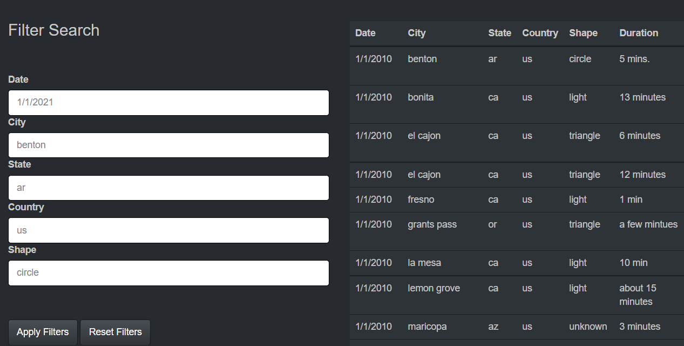

# UFO data filtering with Javascript
The purpose of this challenge was to practice working with Javascript and using D3.js
as an event listener. Using a sample dataset of UFO sightings in the form of a JSON, I created a website with a table of sightings that can be filtered by any or all columns based on user input from a form. 

#### To try out the website, please use the link below and us the form to filter the table

https://dkogel.github.io/UFO-data-filtering-with-Javascript/

*Note: please enter filter criteria you can see displayed in the table, as it's a fairly small dataset. Failing to do so won't create any errors, but you're likely to filter out all of the data and simply get an empty table*

  
  ---  
  
Daniel Kogel  
dkogel123@gmail.com  
www.linkedin.com/in/daniel-kogel  

